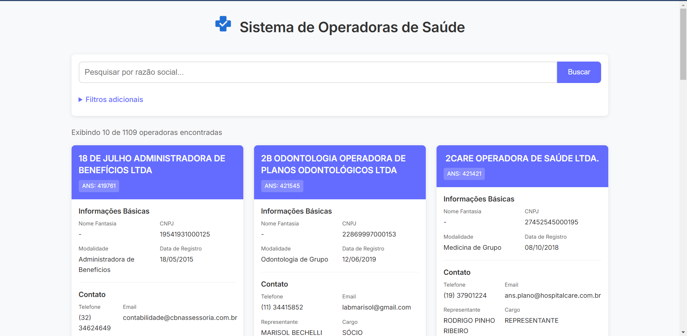

# Teste de API

Este projeto é um sistema completo para consulta de operadoras de planos de saúde ativas no Brasil. Utiliza dados abertos da ANS (Agência Nacional de Saúde Suplementar) para disponibilizar informações detalhadas sobre operadoras através de uma API REST e uma interface web moderna.





## Stack Utilizada

### backend
- **Linguagem:** Python 3
- **Framework:** FastAPI
- **Banco de Dados:** MySQL
- **Bibliotecas:**
    -  `requests` e `beautifulsoup4` – Para download e extração dos dados
    - `mysql-connector-python` – Conexão com o banco de dados
    - `uvicorn` – Servidor ASGI para a API


### frontend
- **Framework:** Vue.js 3
- **Linguagem:** TypeScript
- **Build Tool:**  Vite
- **Bibliotecas:**
    -  `axios` – Para requisições HTTP

## Funcionalidades

- **Download Automático de Dados:** O sistema baixa automaticamente os dados mais recentes das operadoras de saúde diretamente do site da ANS.

- **API REST Completa:** Disponibiliza endpoints para consulta de operadoras com filtros diversos, ordenação e paginação.

- **Interface Web Responsiva:** Frontend moderno com cards informativos, sistema de busca e filtragem intuitiva.

- **Pesquisa Avançada:** Permite filtrar operadoras por UF, cidade, razão social e nome fantasia.

- **Sistema de Paginação:** Navegação eficiente pelos resultados, com controle de itens por página.
## Estrutura do Projeto

```
teste-api/
├── backend/                     # API em FastAPI
│   ├── app/
│   │   ├── controller/          # Controladores da API
│   │   ├── database/            # Conexão com banco de dados
│   │   ├── repositories/        # Repositórios de acesso a dados
│   │   ├── services/            # Camada de serviço
│   │   ├── startup/             # Inicialização e download de dados
│   │   ├── config.py            # Configurações do backend
│   │   └── main.py              # Ponto de entrada da API
│   ├── docker-compose.yml       # Configuração Docker para BD
│   └── requirements.txt         # Dependências Python
│
├── frontend/                   # Interface Vue.js
│   ├── src/
│   │   ├── assets/             # Recursos estáticos
│   │   ├── components/         # Componentes Vue
│   │   ├── services/           # Serviços de API
│   │   ├── types/              # Definições TypeScript
│   │   ├── App.vue             # Componente principal
│   │   └── main.ts             # Ponto de entrada do frontend
│   ├── index.html              # Página HTML principal
│   ├── package.json            # Dependências NPM
│   └── vite.config.ts          # Configuração do Vite
```
## Rodando Localmente

1. **Clone o Repositório:**

   ```bash
   git clone https://github.com/Victor-Saraiva-P/teste-api
   ```

2. **Inicie o Backend:**

   ```bash
   # Inicie o banco de dados MySQL com Docker
    cd backend
    docker-compose up -d

    # Configure o ambiente Python
    python -m venv venv
    source venv/bin/activate  # No Windows: venv\Scripts\activate
    pip install -r requirements.txt
   ```
   Em seguida para iniciar a API execute o arquivo `main.py`

3. **Inicie o Frontend:**  
   ```bash
    cd frontend
    npm install
    npm run dev
   ```

4. **Acesse o Sistema:**
- Frontend: http://localhost:5173
- API: http://localhost:8080

## 👨‍💻 Autor

Desenvolvido por **[Victor Saraiva](https://github.com/Victor-Saraiva-P)**
